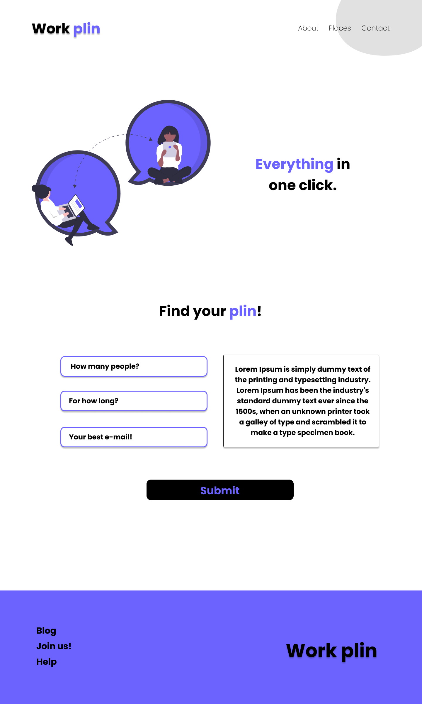

 

  <h3 align="center">Work Plin</h3>

  

    Aqui você encontrará o melhor co-work online!
        
     
    <a href="https://github.com/lubomfim/work-plin">Challenge</a>
  

# Welcome :

Esse projeto foi criado para você que está iniciando, assim como eu!   
This project was made for begginers, just like me!

# Challenge

Seu desafio será construir uma página sobre um site de locação de co-work online.   
Your challenge is to build a landing page for a coworking space

# Techs:

HTML 
CSS

# Requirements:

- Your page should look as close as possible to the visual design. 
- Your page should be responsive 
   

- Sua página deve se parecer o mais próximo possível do design 
- Sua página deve ser responsiva 

- Você pode encontrar o design aqui: <a href="https://www.figma.com/file/m95CWMbgT372P5ytrlSluF/Work-Plin?node-id=0%3A1">Figma</a>
- You can find the design here: <a href="https://www.figma.com/file/m95CWMbgT372P5ytrlSluF/Work-Plin?node-id=0%3A1">Figma</a>

# Colors:

Blue: #6C63FF 
Black: #000000

# Font family:

- Poppins

# Share!

Designed and created by <a href="https://github.com/lubomfim">Lucas</a> :)

  
  Challenge made by: <a href="https://www.linkedin.com/in/rudi-junior/">Rudi</a>
s